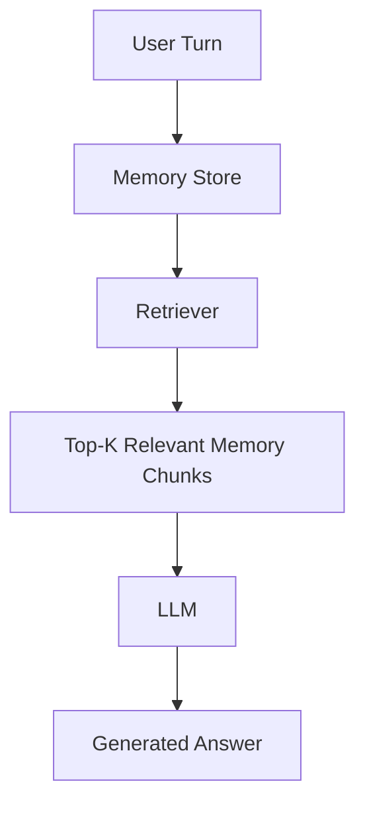

# Dynamic Memory RAG for Long-Term Conversations  
### Retrieval-Augmented Generation (RAG) System for Conversational Memory

This project implements and evaluates a **Retrieval-Augmented Generation (RAG)** architecture designed specifically for *conversational memory*.  
The goal is to understand how different retrieval-based memory mechanisms influence an LLM’s ability to **retain**, **retrieve**, and **update** user-specific information across long multi-turn dialogues.

---

## Project Goal

To build a **RAG Memory Module** capable of:

- Maintaining long-term conversational context  
- Retrieving relevant past information  
- Handling fact updates and contradictions  
- Reducing memory decay over long dialogues  
- Comparing multiple retrieval strategies

We evaluate which RAG memory configuration works best under different conversational conditions.

---

##  Why Conversational RAG?

Standard RAG retrieves external knowledge (web pages, documents).  
However, **in conversation**, the most important context is:

- user preferences  
- personal facts  
- earlier answers  
- past decisions  

Thus, the “knowledge base” becomes the **conversation itself**.

This project implements a **Dynamic Memory RAG System**, where:

- Each message is stored in a memory index  
- A retriever selects relevant past chunks  
- The LLM generates the next answer using retrieved context  

This is *exactly* the RAG principle, applied not to external text but to conversational memory.

---

## RAG Memory Architecture (Our System)

Below is the exact memory architecture used in the system:



We experiment with **four RAG memory configurations**:

| Memory Strategy | Description |
|-----------------|-------------|
| **No Memory (baseline)** | LLM receives only the current turn. |
| **Sliding Window** | Passes last *N* turns directly to the LLM (local context). |
| **RAG Retrieval** | Vector search over the *entire memory store* (global context). |
| **Hybrid RAG** | Sliding-window + retrieval (combined context). |

These four methods represent real RAG variants used in production conversational systems.

---

## Datasets

We evaluate RAG memory on four datasets:

### 1. **Persona Memory RAG Dataset**  
Generated from Persona-Chat.  
Tests fact-based memory for stable user identities.

### 2. **Conflict Persona RAG Dataset**  
Persona facts change over time.  
Tests RAG’s ability to **overwrite outdated memory** and avoid retrieving stale information.

### 3. **Long Conversations (100–120 turns)**  
Simulated dialogues with multiple repeated memory probes.  
Tests **memory decay** and the robustness of retrieval over long histories.

### 4. **LMSYS Conversational Dataset**  
Natural dialogues from real users.  
Tests RAG performance in noisy, real-world interactions.

All datasets contain **explicit & implicit memory probes**,  
with **gold answers** generated using Gemini.

---

## Evaluation Metrics

The project evaluates memory quality using:

### **Cosine Similarity**  
Semantic alignment between the model output and the gold answer.

### **Keyword Recall**  
Checks how many gold factual keywords the model retrieved correctly.

### **MemoryScore** (combined metric)
$$
\text{MemoryScore} = 0.6 \cdot \text{Cosine} + 0.4 \cdot \text{KeywordRecall}
$$


These metrics measure the effectiveness of each RAG memory strategy.

---

## Experimental Results

Instead of presenting multiple separate graphs for each dataset, we provide a unified comparison that summarizes the performance of all memory strategies across all datasets.

### **Cross-Dataset Comparison of Overall Δ-Cosine**

This figure shows the improvement (or degradation) in cosine similarity relative to the no-memory baseline.  
It allows direct comparison of how Sliding Window, Retrieval RAG, and Hybrid RAG behave across:

- LMSYS (natural conversations)  
- PersonaChat (static persona facts)  
- Conflict Persona (evolving, contradictory facts)  
- LongConvos (100–120 turn synthetic dialogues)


---

## Key Findings

### LMSYS (Natural Conversations)
- All methods perform close to the baseline.  
- Retrieval sometimes introduces noisy or irrelevant memory → slight degradation.  
- Sliding Window provides the most stable small improvement.

### PersonaChat (Static Persona Facts)
- **Hybrid RAG** achieves the best performance.  
- Retrieval helps because persona facts are semantically distinct.  
- Sliding Window performs poorly because persona facts appear early and fall outside the window.

### Conflict Persona (Evolving Facts)
- **Sliding Window** performs the best — it naturally prioritizes *recent* facts.  
- Retrieval-based approaches may recall **outdated** persona facts, reducing accuracy.  
- Hybrid RAG partially mitigates this but still underperforms relative to Sliding Window.

### Long Conversations (100–120 turns)
- All RAG strategies significantly outperform the no-memory baseline.  
- **Hybrid RAG** and **Sliding Window** show the strongest long-term stability.  
- Retrieval alone performs well but slightly suffers from noise accumulation over long dialogues.

---

## Experimental Pipeline

1. Generate/clean datasets  
2. Insert memory probes (explicit & implicit)  
3. Build RAG memory store (vector embeddings)  
4. Apply different retrieval strategies  
5. Generate answers using LLM  
6. Evaluate results using cosine, recall, and MemoryScore  

---

## Running the Project

```bash
# Install dependencies
pip install -r requirements.txt

# Add your Gemini API key
export GOOGLE_API_KEY="YOUR_KEY"

# Generate datasets
python generate_persona_dataset.py
python generate_conflict_persona_dataset.py
python generate_long_persona_conversations.py
python generate_lmsys_memory_dataset.py

# Run memory experiments
python run_memory_experiments.py

# Evaluate results
python evaluate_memory_results.py


